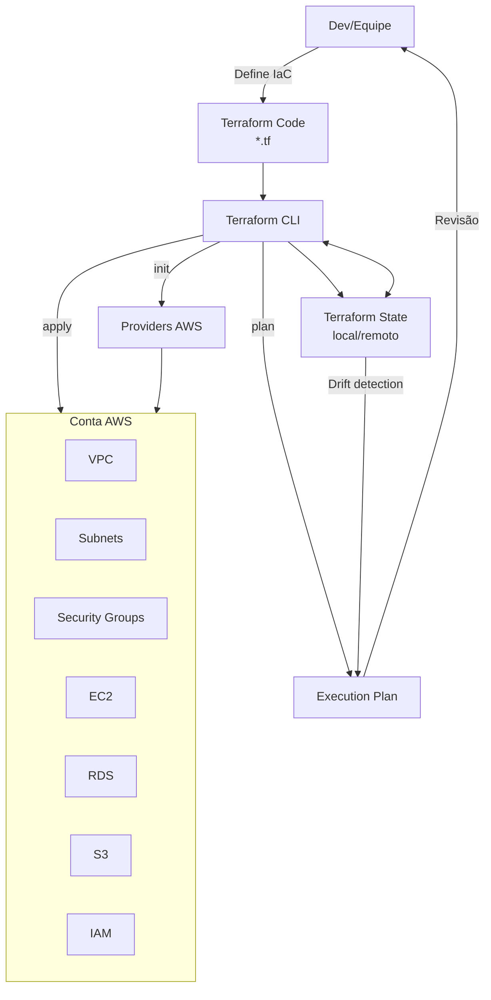

# Arquitetura Terraform + AWS

Este diagrama resume como o Terraform interage com a AWS para provisionar e manter infraestrutura como código.

## Componentes principais

- **Terraform Code**: arquivos `.tf` com os recursos, variáveis e módulos.
- **Terraform CLI**: executa `init`, `plan` e `apply`.
- **Providers**: plugins que traduzem recursos Terraform para APIs da AWS.
- **Execution Plan**: prévia das mudanças antes de aplicar.
- **Terraform State**: estado atual da infraestrutura; pode ser local ou remoto (ex.: S3 + DynamoDB).
- **Recursos AWS**: VPC, subnets, segurança, computação e serviços gerenciados.

## Fluxo resumido

1. A equipe define infraestrutura em `.tf`.
2. `terraform init` prepara providers e backend.
3. `terraform plan` compara estado atual e desejado.
4. `terraform apply` cria/atualiza recursos na AWS.
5. O state mantém o histórico e permite detectar drift.
